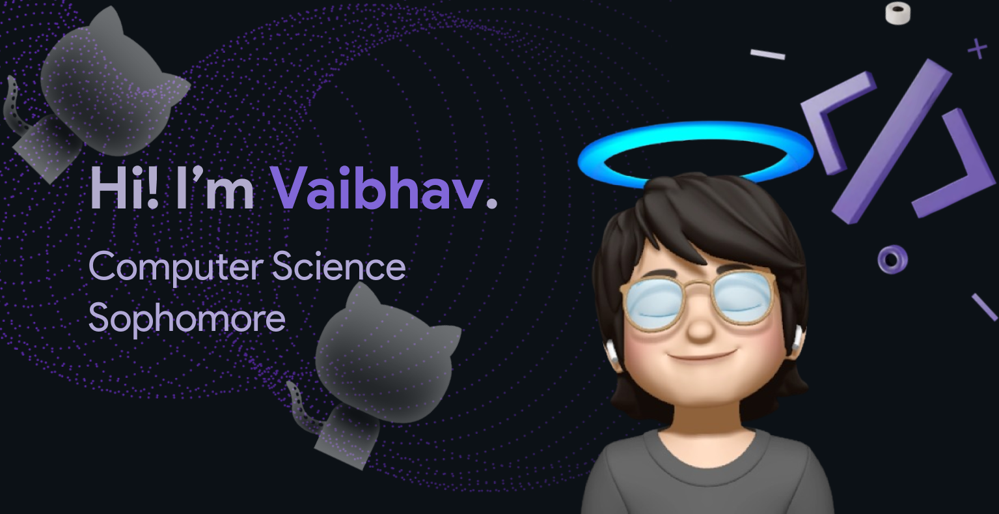

<!--   -->

### 

###

<h2 align="left">🧑🏻‍🎓 About Me </h2>

  👋 Hey there! I'm Vaibhav Kumawat, currently a sophomore at Navrachana University. My passion lies in design, whether it's frontend development or UI/UX - I'm all in! 😍 AI, productivity tools, startups, and the latest tech trends? Count me in for a discussion anytime! 

  💡 With a strong tech inclination, I'm majoring in computer science while also diving into mechatronics through a minor. I thrive on connecting with the tech community and believe in the power of knowledge sharing - it's all about connecting those dots in the tech world! 🌐  

  🚀 Beyond design, I'm digging into data structures and algorithms, excited to merge creativity with a solid understanding. 📚 Strengthening my problem-solving abilities is always a priority.  

  🔍 Peering into the future, I'm eagerly seeking fascinating research projects. 🚀 If you're up for a mind-expanding journey, let's team up and explore together! 💡  

  Need help with Designing, front-end work, or tools like Figma and Canva? Consider me your go-to guru. 📄  

 Curious to dive deeper into my journey and ventures? Feel free to peek into my adventure log at: https://read.cv/vaibhav_kumawat 🚀
 

  👨‍💻 Let's connect and collaborate! 🤝  

###
---

<h2 align="left">💻 Tech Stack</h2>

 

  

<h2 align="left">🌐 Connect with me</h2> 

 

  
  

###

<h2 align="left">⚡️Stats</h2>

    
    
    

###

<!-- 
<h2 align="left">🛒Support:</h2>

   -->